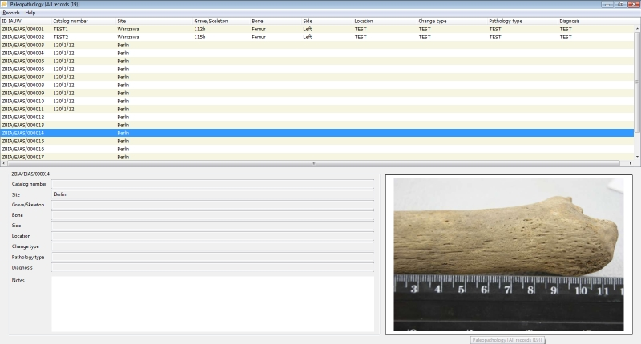

# PaleopathologyGallery
A simple desktop paleopathological database

## Dependencies

- Windows 7, 8, 10 (probably works under Linux/Wine)

## Tools required to develop

- REALbasic 2009
- Einhugur plugins

## Documentation

[Help (pl)](https://github.com/pjaskulski/PaleopathologyGallery/blob/master/doc/paleopathology.md)

## Releases

### 1.0 alpha

[PaleopathologyGallery1.0.zip](https://github.com/pjaskulski/PaleopathologyGallery/releases/download/ver1.0/PaleopathologyGallery1.0.zip)
