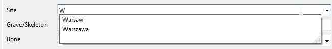
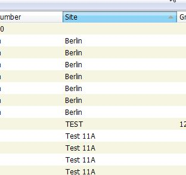
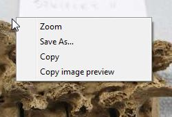
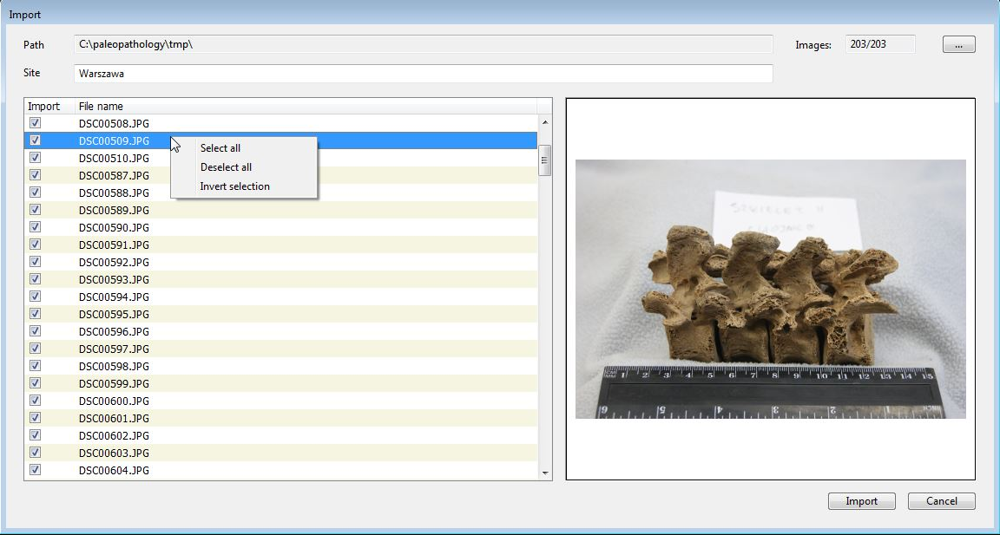
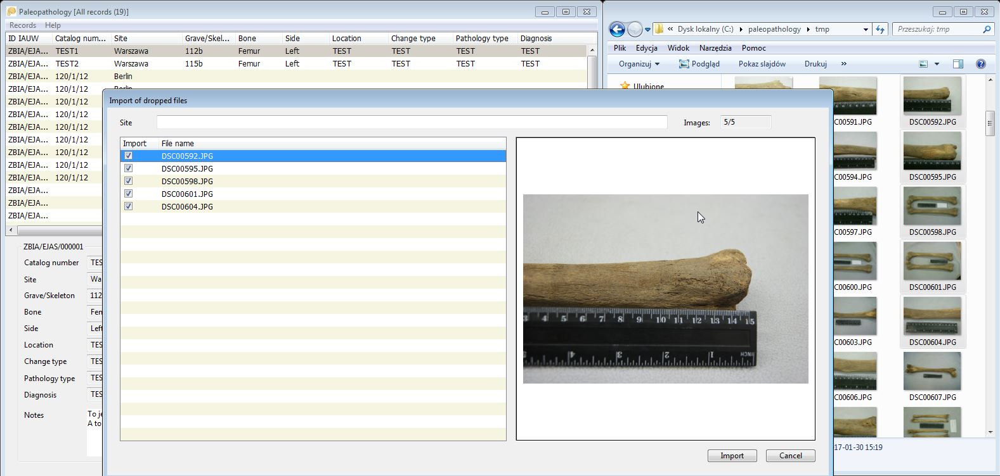
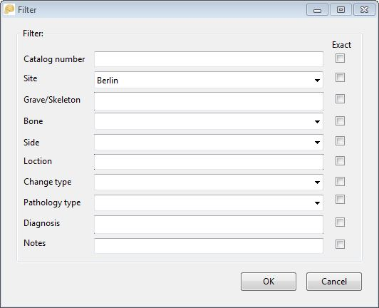
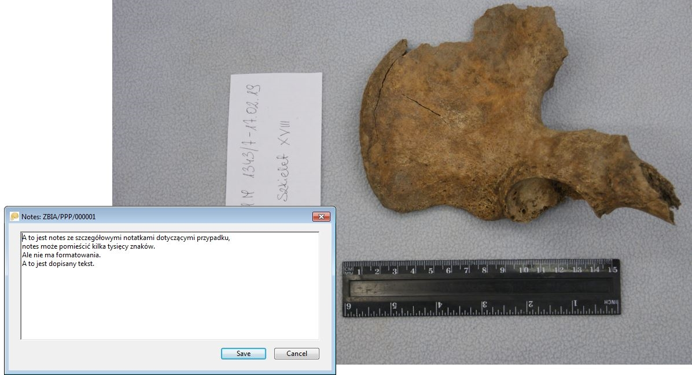

## Dependencies

- Windows 7, 8, 10 (probably works under Linux/Wine)

## Tools required to develop

- REALbasic 2009
- Einhugur plugins

## Documentation (for now, only in Polish)

* [Instalacja i uruchomienie](paleopathology.html#instalacja-i-uruchomienie)
* [Ogólny wygląd programu](paleopathology.html#ogolny-wyglad-programu)
* [Dołączanie i edycja rekordu](paleopathology.html#dolaczanie-i-edycja-rekordu)
* [Usuwanie rekordów](paleopathology.html#usuwanie-rekordow)
* [Modyfikacje bezpośrednio w tabeli danych](paleopathology.html#modyfikacje-bezposrednio-w-tabeli-danych)
* [Praca z tabelą danych - sortowanie, kopiowanie rekordu (-ów)](paleopathology.html#praca-z-tabela-danych)
* [Okno podglądu zdjęcia - kopiowanie podglądu, zapis, zoom](paleopathology.html#okno-podgladu-zdjecia)
* [Import zdjęć z folderu](paleopathology.html#import-zdjec-z-folderu)
* [Przeciąganie zdjęć do programu](paleopathology.html#przeciaganie_zdjec)
* [Synchronizacja z inną bazą danych](paleopathology.html#synchronizacja-z-inna-baza-danych)
* [Wyszukiwanie](paleopathology.html#wyszukiwanie)
* [Filtrowanie](paleopathology.html#filtrowanie)
* [Zapis zdjęcia](paleopathology.html#zapis-zdjecia)
* [Eksport danych](paleopathology.html#eksport-danych)
* [Zoom - podgląd powiększonego zdjęcia](paleopathology.html#zoom)
* [Kopia zapasowa danych](paleopathology.html#kopia-zapasowa-danych)

## Instalacja i uruchomienie

Program nie wymaga instalacji, folder z programem można skopiować na dysk lokalny i uruchomić plik PaleopathologyGallery.exe. Można także uruchomić program np. bezpośrednio z urządzenia pen-drive, ale działanie programu będzie wówczas bardziej powolne.  Podczas pierwszego uruchomienia program sprawdza czy istnieje podfolder 'data' a w nim kolejne podfoldery 'image' (na zdjęcia oryginalne) i 's-image' (na miniatury zdjęć do szybkiego przeglądania) - jeżeli nie, zostaną automatycznie założone. Dodatkowo w przypadku pierwszego uruchomienia zostanie założona baza danych paleopathology.db (w formacie sqlite3).

Podczas uruchomienia, jeszcze przed wyświetleniem danych program oczekuje wprowadzenia symbolu (identyfikatora) badacza, który będzie wprowadzał dane. Ma to znaczenie podczas dołączania nowych rekordów, gdyż symbol badacza będzie elementem identyfikatora rekordu np.
*IA/SYMBOL/000001*. Bez wprowadzonego symbolu dalsza praca z programem nie będzie możliwa.

## Ogólny wygląd programu

Po uruchomieniu wyświetlane jest główne okno programu, podzielone na trzy części. Górną część okna zajmuje tabela danych (lista rekordów), w dolnej lewej części prezentowane są szczegółowe dane bieżącego rekordu. W dolnej prawej części - podgląd zdjęcia przypisanego do bieżącego rekordu.   

W pasku tytułu aplikacji widoczna jest liczba rekordów w bazie danych lub liczba rekordów zgodnych z aktualnie nałożonym filtrem.

## Dołączanie i edycja rekordu

Aby dołączyć nowy rekord do bazy należy skorzystać z menu *Records -> New* lub użyć skrótu klawiszowego CRTL+N. Program wyświetli puste okno edycji rekordu:

  

w którym należy uzupełnić dane rekordu. Niektóre pola np. *Site*, *Bone* są polami wspomaganymi słownikiem, to znaczy że zamiast wpisywania wartości można wybrać z rozwijanej listy gotową wartość - jedną z wpisanych w poprzednich rekordach. Pole 'słownikowane' obsługuje także funkcję autouzupełniania, tzn. że można wpisać pierwszą literę oczekiwanej wartości a program zawęzi zawartość słownika do pozycji zaczynających się na wpisaną literę.

  

Pole *Notes* wyróżnia się możliwością wprowadzenia wielu wierszy tekstu. Długość wprowadzanego tekstu jest praktycznie nieograniczona (> 1 mln znaków).

Jeżeli w trakcie edycji rekordu użytkownik naciśnie przypadkiem klawisz ESC lub  
przycisk **Cancel** program poinformuje, że wprowadzono dane do pól okna rekordu i zapyta czy na pewno dane te mają zostać utracone:

  

Przycisk **Image** pozwala na wskazanie zdjęcia związanego z rekordem, program akceptuje pliki w formacie JPG. Wskazane zdjęcie jest wyświetlane w formie miniatury w polu podglądu. Podczas zapisywania nowego rekordu wskazany plik ze zdjęciem jest kopiowany do folderu 'image' w folderze danych programu ('data'), nazwa pliku jest zmieniana automatycznie na nazwę techniczną związaną z identyfikatorem rekordu. Dodatkowo, również automatycznie, tworzona jest miniatura zdjęcia, również w formacie JPG, o rozdzielczości nie większej niż 800x600. Plik miniatury jest używany podczas przeglądania danych w głównym oknie programu.

Podczas zapisywania nowego rekordu program tworzy identyfikator (ID) rekordu. Identyfikator składa się z symbolu instytucji (IA - Instytut Archeologii), symbolu badacza, oraz kolejnego nr rekordu. Nr rekordu jest niepowtarzalny w obrębie jednej bazy, w przypadku usunięcia ostatniego rekordu - nr jest 'reużytkowany', w przypadku usuwania rekordów ze 'środka' bazy danych, system pozostawia puste miejsca w numeracji. 

Procedura edycji istniejącego rekordu przebiega podobnie do dołączania nowego, wywoływana jest funkcją *Records->Edit* (lub skrótem klawiszowym CRTL+E). W oknie edycji wyświetlone zostają uprzednio wprowadzone dane, w tym podgląd związanego z rekordem zdjęcia. Przyciskiem **Image** można zmienić zdjęcie na inne, pliki zapisane w folderach 'image' i 's-image' zostaną zastąpione przez wskazane nowe zdjęcie.     

  

## Usuwanie rekordów

Usuwanie rekordów umożliwia funkcja *Records -> Delete* (lub skrót klawiszowy CRTL+D). Przed usunięciem rekordu aplikacja pyta o potwierdzenie. Usuwany jest zarówno rekord danych jak i plik ze zdjęciem (jeżeli był) oraz plik miniatury.

 

## Modyfikacje bezpośrednio w tabeli danych

Oprócz modyfikacji danych w oknie edycji rekordu możliwe jest także bezpośrednie wprowadzanie zmian w tabeli danych. Opcja ta dotyczy większości pól bazy z wyjątkiem pola *ID* i *Notes*. Aby przejść do trybu edycji pola w tabeli danych należy dwukrotnie kliknąć w daną komórkę tabeli.

 

Alternatywnie można tryb bezpośredniej edycji uruchomić skrótem klawiszowym CRTL+W, który powoduje przejście w tryb edycji bieżącego rekordu w kolumnie CATALOG NUMBER.
W trybie edycji zmienia się wygląd komórki tabeli - tło staje się białe, program zaznacza całą zawartość pola (jeżeli jakaś jest). W edytowanej komórce działają standardowe skróty klawiszowe: CRTL+C - kopiuj, CRTL+V - wklej. Możliwe jest przejście w trybie edycji do sąsiednich pól - klawisz TAB przenosi nas do kolumny po prawej, kombinacja klawiszy SHIFT+TAB - w lewo, strzałki w górę i w dół przenoszą edycję w ramach tej samej kolumny, ale do poprzednich lub następnych rekordów. Podczas edycji komórki można zrezygnować ze zmian - klawiszem ESC (program przywraca wówczas pierwotną zawartość) lub zatwierdzić klawiszem ENTER, co spowoduje zapisanie zmian w bazie danych. Przechodzenie między komórkami w trybie edycji również powoduje automatycznie zapisanie zmian w opuszczanej komórce.

Takie działanie tabeli danych pozwala na szybie uzupełnianie kolumn danych tą samą wartością - po zapamiętaniu zawartości pola poprzez CRTL+C, można 'klonować' tą wartość w kolejnych rekordach poprzez kombinację klawiszy: strzałka w dół i CRTL+V.

## Praca z tabelą danych - sortowanie, kopiowanie rekordu (-ów)

Podczas przeglądania danych w tabeli danych (górna część głównego okna programu) można zmieniać kolejność rekordów - kliknięcie w nagłówek pola tabeli powoduje przesortowanie danych według tego pola, powtórne kliknięcie - przesortowanie odwrotne (czyli rosnąco lub malejąco). Program oznacza kolorem nagłówek kolumny wg której posortowano dane, a z prawej strony nagłówka szarą strzałką kierunek sortowania (malejąco - rosnąco).  

Tabela danych posiada dodatkowe funkcje dostępne poprzez podręczne menu (prawy przycisk myszy):

- *Copy record data* - kopiuje dane bieżącego rekordu, w formie umożliwiającej wklejenie do np. edytora tekstu.
- *Copy all records* - kopiuje całą zwartość tabeli danych, w formie wierszy i pól rozdzielanych tabulatorem, ułatwiającej wklejenie do np. arkusza kalkulacyjnego.
- *Zoom* - wywołuje okno z powiększonym zdjęciem przypisanym do bieżącego rekordu.

## Okno podglądu zdjęcia - kopiowanie podglądu, zapis, zoom

Wyświetlane w dolnej prawej części głównego okna programu pole z podglądem zdjęcia umożliwia wywołanie kilku dodatkowych funkcji, dostępnych poprzez podręczne menu wywoływane prawym klawiszem myszy:

   

- *Zoom* - wywołuje okno z powiększonym zdjęciem przypisanym do bieżącego rekordu.
- *Save As...* - umożliwia zapisanie zdjęcia (oryginalnego zdjęcia, nie miniatury z podglądem zdjęcia) we wskazanym przez użytkownika miejscu.
- *Copy* - kopiuje zdjęcie do schowka.
- *Copy image preview* - kopiuje miniaturę zdjęcia do schowka.

## Import zdjęć z folderu

W przypadku wprowadzania dużej liczby zdjęć do bazy danych można skorzystać z funkcji *Records->Import*, która pozwala na importowanie zdjęć ze wskazanego folderu. Po wywołaniu funkcji program wyświetla okno importu:

   

W oknie importu, w polu *Path* można wskazać ścieżkę do folderu ze zdjęciami w formacie JPG. Po wskazaniu folderu program sprawdza jego zawartość i wszystkie znalezione pliki jpg są wyświetlane w tabelce po lewej stronie okna, po prawej wyświetlany jest podgląd dla bieżącego pliku. Możliwe jest zaznaczenie grupy plików - zaznaczanie/odznaczanie odbywa się poprzez kliknięcie myszą na polu check-box w pierwszej kolumnie, lub poprzez klawisz SPACJI. Podręczne menu tabelki plików umożliwia zaznaczenie od razu wszystkich plików (*Select all*), odznaczenie wszystkich plików (*Deselect all*) lub odwrócenie zaznaczenia (*Invert selection*).

   

Widoczne w górnym prawym rogu pole *Images* wyświetla liczbę plików zaznaczonych oraz liczbę wszystkich dostępnych plików w  wybranym folderze. Pole *Site* umieszczone ponad tabelką z listą plików umożliwia wpisanie domyślnej zawartości pole Site w dodawanych rekordach.

Po wyborze plików przycisk Import rozpoczyna procedurę importu zdjęć i dodawania rekordów do bazy danych.

Podczas importu zdjęć program wyświetla pasek postępu, po zakończeniu importu okno jest zamykane i wyświetlona zostaje główna tabela danych a w niej ostatnio dodanych rekord.

## Przeciąganie zdjęć do programu

Program obsługuje możliwość przeciągania plików zdjęć np. z eksploratora Windows do tabeli danych w głównym oknie programu. W przypadku pojedynczego zdjęcia, program wyświetli okno identyczne jak przy dodawaniu nowego rekordu, z wczytanym już podglądem zdjęcia - wystarczy uzupełnić dane rekordu i zapisać (plik zdjęcia zostanie skopiowany do folderu danych, zostanie także utworzona miniatura).

W przypadku przeciągnięcia większej liczby zdjęć program wyświetli okno zbliżone do okna importu z folderu, w którym można uzupełnić pole *Site* i przyciskiem **Import** rozpocząć import zdjęć do bazy danych.

 

## Synchronizacja z inną bazą danych

Funkcja synchronizacji wywoływana z menu *Records->Synchronization* umożliwia pobranie rekordów i zdjęć z bazy innego użytkownika.

Po uruchomieniu wyświetlane jest okno synchronizacji, w którym należy wskazać ścieżkę do folderu danych z którego będą importowane dane. W folderze tym powinna znajdować się baza danych (plik paleopathology.db), oraz podfoldery 'image' i 's-image'. Po wskazaniu folderu program wyświetli listę rekordów które można zaimportować do naszej bazy danych, wyświetlane są pola ID, CAT. NO i SITE, oraz podgląd bieżącego zdjęcia związanego z rekordem. Podobnie jak w przypadku importu folderu zdjęć w podręcznym menu dostępne są funkcje zaznaczania i odznaczania wszystkich rekordów.    

## Wyszukiwanie

Aplikacja umożliwia proste wyszukiwanie w tabeli danych. Po wywołaniu funkcji z menu *Records->Find* (lub skrótu klawiszowego CRTL+I) wyświetlane jest okno wyszukiwania:

W oknie znajduje się tylko jedno pole w które należy wprowadzić poszukiwany tekst. Wyszukiwanie następuje we wszystkich polach bazy danych. Jeżeli tekst zostanie znaleziony program ustawia się na znalezionym rekordzie w tabeli danych. Można wyszukać kolejne wystąpienia poprzez menu *Records->Find next* (lub skrótem klawiszowym F3).      

## Filtrowanie

Oprócz wyszukiwania dostępna jest także możliwość filtrowania danych, wywoływana poprzez menu *Records->Filter* (lub skrót klawiszowy CRTL+F). Program wyświetla wówczas okno z możliwością wprowadzenia warunków filtrowania:

W oknie widoczne są wszystkie pola bazy danych (poza ID), możliwe jest wprowadzenie fragmentu tekstu który ma być odnaleziony w danym polu, lub wymuszenie by wprowadzony tekst miał być dokładnie zgodny z zawartością pola (należy wówczas zaznaczyć check-box widoczny z prawej strony pola). Cześć z pól, np. *Site*, *Bone* czy *Change type* posiada (podobnie jak przy edycji rekordu) możliwość wyboru wartości ze słownika (pola rozwijanego), w którym znajdują się wszystkie (niepowtarzające się) wartości występujące w danym polu w całej bazie danych.

Po wprowadzeniu oczekiwanych wartości można przyciskiem OK uruchomić proces filtrowania, w wyniku którego tabela danych zostanie ograniczona do rekordów spełniających warunki filtra. W pasku tytułu programu zostanie wyświetlona informacja o liczbie znalezionych rekordów.

Przywrócenie wyświetlania wszystkich rekordów z bazy danych jest możliwe dzięki funkcji *Records->Show all records* (lub skrót CRTL+G).

## Zapis zdjęcia

Funkcja *Records->Copy file to* (lub CRTL+P)pozwala na zapis zdjęcia przypisanego do bieżącego rekordu w miejsce wskazane przez użytkownika.

## Eksport danych

Funkcja *Records->Export...* umożliwia zapisanie bazy danych w formie pliku tekstowego csv (separatorem pól jest średnik). Plik taki można łatwo wczytać do arkusza kalkulacyjnego.

## Zoom - podgląd powiększonego zdjęcia

Funkcja *Records->Zoom* (skrót CRTL+M lub ENTER) wywołuje okno z powiększonym zdjęciem przypisanym do bieżącego rekordu.

Okno Zoom posiada dodatkowe funkcje widoczne w podręcznym menu (prawy przycisk myszy).

- *Full Size* - wyświetla zdjęcie w pełnej rozdzielczości, rozmiary zdjęcia mogą przekraczać rozmar okna Zoom, wówczas możliwa jest nawigacja poprzez paski skrolowania (u dołu i po prawej stronie okna), lub poprzez klawisze 'strzałek' oraz PageUp i PageDown a także za pomocą myszy.
- *10%* do *90%* - skaluje zdjęcie do wybranej wielkości procentowej
- *Fit image to screen* - przywraca domyślny rozmiar zdjęcia dopasowany do wielkości okna Zoom. 
- *Save As...* - umożliwia zapisanie zdjęcia we wskazanym przez użytkownika miejscu.
- *Copy* - kopiuje zdjęcie do schowka.
- *Rotate right* - obraca zdjęcie o 90 stopni w prawo (w oknie Zoom, zmiana nie jest zapisywana w pliku).
- *Rotate left* - obraca zdjęcie o 90 stopni w lewo (j.w.).
- *Notes* - wyświetla okienko z możliwością edycji pola Notes.
- *Close* - zamyka okno Zoom, alternatywnie można użyć przycisku w górnym prawym rogu okna lub klawisza ESC.  

## Kopia zapasowa danych

Podczas uruchomienia programu tworzona jest automatycznie kopia bazy danych
w pliku paleopathology.backup. Jeżeli istniała poprzednia kopia - jest ona nadpisywana. W razie uszkodzenia danych podczas bieżącej sesji z programem (np. w przypadku błędnego usunięcia danych przez użytkownika) można po wyjściu z aplikacji nadpisać bazę paleopathology.db plikiem paleopathology.backup i ponownie uruchomić program. **Uwaga**: kopia zapasowa dotyczy danych - nie zdjęć.
