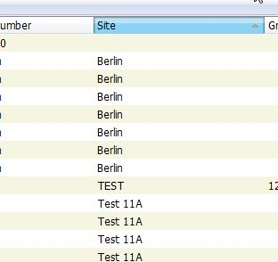
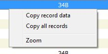
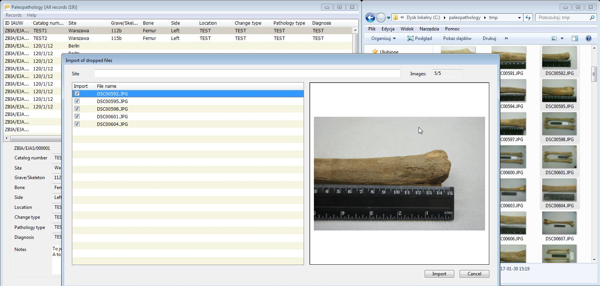
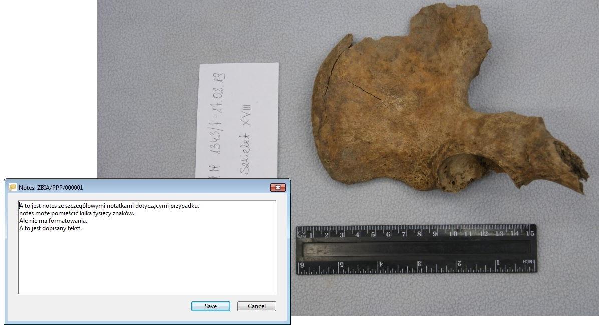

# PaleopathologyGallery

- [Installation and launch](#installation-and-launch)
- [The overall appearance of the program](#the-overall-appearance-of-the-program)
- [Attach and edit a record](#attach-and-edit-a-record)
- [Deleting records](#deleting-records)
- [Modifications directly in the data table](#modifications-directly-in-the-data-table)
- [Working with data table](#working-with-data-table)
- [Image preview window](#image-preview-window)
- [Import photos from a folder](#import-photos-from-a-folder)
- [Drag photos to the program](#drag-photos-to-the-program)
- [Synchronization with another database](#synchronization-with-another-database)
- [Search](#search)
- [Filtering the records](#filtering-the-records)
- [Record photo](#record-photo)
- [Data export](#data-export)
- [Preview of the enlarged photo](#preview-of-the-enlarged-photo)
- [Data backup](#data-backup)

## Installation and launch

The program does not require installation. After copying the folder with the program to a local disk run the PaleopathologyGallery.exe file. You can also run the program directly from the pen-drive, but it will slow the program significantly. During the first launch, the program checks, if there is a subfolder 'data' and it’s subfolders: 'image' (for original photos) and 's-image' (for thumbnail images for quick browsing) - if not, they will be automatically created. In addition, during the first launch, the paleopathology.db database will be created (in sqlite3 format).

During each launch, before the data is displayed, the program requires entering the researcher's symbol (identifier) uniquely describing the person who will enter the data. This is important when attaching new records because the researcher's symbol will be part of the record identifier, eg IA / SYMBOL / 000001. Without the logging with researcher ID, further work with the program will not be possible.

## The overall appearance of the program

After starting, the main program window is displayed, divided into three parts. The upper part of the window is occupied by the data table (list of records), in the lower left part, the detailed data of the current record is presented. In the lower right part - preview of the photo assigned to the current record.

  

The application title bar shows the number of records in the database or the number of records matching the currently imposed filter.

## Attach and edit a record

To attach a new record to the database, use the menu *Records -> New* or use the keyboard shortcut CTRL + N. The program will display an empty record editing window:

  

which allows for entering the data for the record. Some fields, eg *Site*, *Bone* are supported by a dictionary, which means that instead of entering values, you can choose existing one from the drop-down list. The list comprises of all of the previous entries. The 'dictionary' field also supports the autocomplete function, i.e. you can enter the first letter of the expected value and the program will narrow the dictionary's content to entries beginning with the letter you enter.

The *Notes* field allows entering many lines of text. The length of the entered text is virtually unlimited (> 1 million characters).

 

If during the editing of the record the user accidentally presses the ESC or the **Cancel** button program will display warning that data has been entered into the fields of the record window and will ask for confirmation that user want the data to be lost:

  

The **Image** button allows indicating the image related to the record; the program accepts files in JPG format. The photo is displayed in the form of a thumbnail in the preview field. When saving a new record, the photo file is copied to the 'image' folder in the program data folder ('data'), the file name is automatically changed to the technical name associated with the record identifier. Additionally, also automatically, a thumbnail image is created, also in JPG format. Its resolution will not exceed 800x600. The thumbnail file is used when viewing data in the main program window.

When saving a new record, the program creates the ID (ID) of the record. The identifier consists of the institution's symbol (now: IA - Institute of Archaeology), the symbol of the researcher, and the next record number. The record number is unique within one database, in the case of deleting the last record - the number is 'reused', in the case of deleting records from the 'middle' of the database, the system leaves empty spaces in the numbering.

The procedure for editing an existing record is similar to adding a new record, it is called by the *Records-> Edit* function (or the keyboard shortcut CTRL + E). The editing window displays the previously entered data, including the preview associated with the photo record. Using the Image button you can change the image file, the files saved in the 'image' and 's-image' folders will be replaced with the indicated new photo.

  

## Deleting records

Deleting records is possible with the Records -> Delete function (or the keyboard shortcut CTRL + D). Before deleting the record, the application asks for confirmation. Both the data record and the photo file (if any is attached to the record) and the thumbnail file are deleted.

  

## Modifications directly in the data table

In addition to data modification in the record editing window, it is also possible to directly make changes to the data table. This option applies to most database fields except the *ID* and *Notes* fields. To enter the field edition mode in the data table, double-click on the given table cell.

  

Alternatively, the direct editing mode can be run with the keyboard shortcut CTRL + W, which causes the editing mode of the current record in the CATALOG NUMBER column. In the edit mode, the appearance of the table cell changes - the background becomes white, the program selects the entire contents of the field (if any). Standard hotkeys work in the cell being edited: CTRL + C - copy, CTRL + V - paste. It is possible to move to the adjacent fields in the edit mode - the TAB key takes you to the right column, the SHIFT + TAB key combination - to the left, the up and down arrows move the edition within the same column, but to the previous or next records. While editing a cell, you can choose not to enter any of the changes - use the ESC key (the program then restores the original content) or confirm with the ENTER key, which will save the changes in the database. Moving between cells in the edit mode also automatically saves changes in the edited cell.

## Working with data table

When viewing records in the data table (upper part of the main program window), the order of records can be changed - clicking on the table field header sorts the data according to this field, re-clicking - reverse sorting (i.e. ascending or descending). The program colours the header of the column in which the data has been sorted, and the sorting direction (descending - ascending) is indicated on the right side of the header with a relevant grey arrow.

  

The data table has additional functions available through the pop-up menu (right mouse button):

  

- *Copy record data* - copies data of the current record, in a form that allows you to paste into e.g. a text editor.
- *Copy all records* - copies the whole content of the data table, in the form of rows and tab-delimited fields, which facilitates pasting into eg a spreadsheet.
- *Zoom* - opens a window with an enlarged photo assigned to the current record. 

## Image preview window

The field with image preview displayed in the bottom right part of the main program window allows you to select several additional functions accessible via the right-click popup menu:

     

- *Zoom* - opens a window with an enlarged photo assigned to the current record.
- *Save As...* - allows you to save a photo (the original photo, not a thumbnail with a photo preview) in the place indicated by the user.
- *Copy* - copies the photo to the clipboard.
- *Copy image preview* - copies the thumbnail image to the clipboard.

## Import photos from a folder

If there is a need to enter a large number of photos into the database, the *Records-> Import* function can be used, which allows to import photos from the selected folder. After selecting this option, the program displays the import window:

     

In the import window, in the Path field, you can specify the path to the folder with photos in JPG format. After indicating the folder, the program checks its contents and all found jpg files are displayed in the table on the left side of the window, on the right the preview of the current file is displayed. It is possible to select a group of files - selecting/deselecting is done by clicking the mouse on the checkbox in the first column, or by the SPACE key. The pop-up menu of the file list allows you to select all files at once (*Select all*), deselect all files (*Deselect all*) or invert the selection (*Invert selection*).

     

The *Images* field, visible in the upper right-hand corner, displays the number of selected files and the number of all available files in the selected folder. The *Site* field placed above the file list allows you to enter the default Site field content in the added records.

After selecting the files, the **Import** button starts the procedure for importing photos and adding records to the database.

  

When importing photos, the program displays a progress bar, when the import is finished the window is closed, the main data table is displayed and the last record added.

## Drag photos to the program

The program supports the dragging of the photo files, e.g. from the Windows Explorer to the data table in the main program window. If a single photo is dragged, the program will display the same window as when adding a new record, with already loaded image preview – allowing for filling out the record data and saving (the photo file will be copied to the data folder, a thumbnail will also be created).

  

If you drag a larger number of photos, the program will display a window similar to the import photos from the folder in which the Site field can be filled out and the Import button will start importing photos into the database.

 

## Synchronization with another database

The synchronization function available from the *Records-> Synchronization* menu allows downloading records and photos from another user's database.

  

After selecting the synchronisation option, the synchronization window is displayed, in which the path to the data folder from which the data will be imported should be indicated. The folder should contain a database (paleopathology.db file), and subfolders 'image' and 's-image'. After indicating the folder, the program will display a list of records that can be imported into our database, the ID, CAT NO. and SITE fields are displayed with a preview of the current photo related to the record. As with the import of a photo folder, the functions of selecting and deselecting records are available in the pop-up menu.

## Search

The application allows a simple search in the data table. After calling the function from the *Records-> Find* menu (or the keyboard shortcut CTRL + I) the search window is displayed:

  

In the window, there is only one field in which the desired text should be entered. The search is carried out in all fields of the database. If the text is found, the program sets to the found record in the data table. You can search for subsequent occurrences via the *Records-> Find next* menu (or pressing F3 key).

## Filtering the records

In addition to the search, there is also the option for data filtering, called via the menu *Records-> Filter* (or the keyboard shortcut CTRL + F). The program then displays a window with filtering options:

  

In the window, you can see all the fields of the database (except ID). It is possible to enter a fragment of the text to be found in a given field or to force the entered text to be exactly compatible with the field contents (check box must be visible on the right side of the field ). Some of the fields, e.g. *Site*, *Bone* or *Change type* have (just like when editing a record) the ability to choose values from a dictionary (drop-down box), in which all (non-recurring) values appear in a given field in the entire database.

After entering the expected values, you can start the filtering process with the OK button. The filtered data table will be limited to the records that meet the filter conditions. The program title bar will display information about the number of records found.

  

Reverting to original data table, displaying all records from the database require selecting Records-> Show all records option (or the abbreviation CTRL + G).

## Record photo

The *Records-> Copy file to* (or CTRL + P) function allows you to save an image file assigned to the current record to the place indicated by the user.

## Data export

The *Records-> Export...* function makes it possible to save the database in the form of a .csv text file (the field separator is a semicolon). Such a file can be easily loaded into a spreadsheet.

## Preview of the enlarged photo

The *Records-> Zoom* function (CTRL + M or ENTER shortcut) brings up a window with an enlarged photo assigned to the current record.

  

The Zoom window has additional functions visible in the pop-up menu (the right mouse button).
- *Full Size* - displays the picture in full resolution, the size of the photo can exceed the size of the Zoom window, then you can navigate using the scrolling bars (bottom and right of the window), or through the 'arrows' keys and PageUp and PageDown keys as well as with the mouse.
- *10% to 90%* - scales the photo to the selected percentage
- *Fit image to screen* - restores the default photo size adjusted to the size of the Zoom window.
- *Save As...* - allows you to save the image in the place indicated by the user.
- *Copy* - copies the photo to the clipboard.
- *Rotate right* - rotates the photo 90 degrees clockwise (in the Zoom window, the change is not saved in the file).
- *Rotate left* - rotates the photo 90 degrees counter-clockwise ( no permanent as described before).
- *Notes* - displays a window with the option of editing the Notes field.
- *Close* - closes the Zoom window, alternatively, you can use the button in the upper right corner of the window or the ESC key.

  

## Data backup

When you run the program, a copy of the database is automatically created in the paleopathology.backup file. If there was a previous copy - it is overwritten. In the event of data corruption during the current session with the program (e.g. in case of incorrect deletion of data by the user), after exiting the application, you can overwrite the paleopathology.db database with the paleopathology.backup file and restart the program. **Note**: the backup applies to data - not to photo files.
